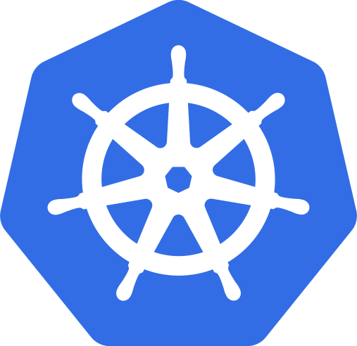
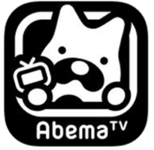
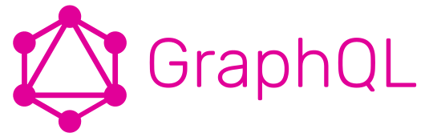
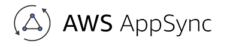

### Introduction of Rancher
2019/02/21 komori issei

---
#### Agenda

- What's Docker? |
- What's Kubernetes? |
- What's Rancher? |
- Rancher Demo |

---

---

#### What's Docker?
- About
  - コンテナ型の仮想環境を作成、配布、実行するためのプラットフォーム |

+++

#### What's Docker?
~~~
  ------------------------
  | Container | Container |
  ------------------------
  |     Docker Engine     |
  ------------------------
  |       Host OS         |
  ------------------------
~~~

---

---

#### What's Kubernetes?
- About
  - Google社内のオーケストレーションシステムからインスパイアされて作成されたOSSの「コンテナオーケストレーションツール」 |
  - クーバーネーティス、クーバネィティス、クバネティスetc.. |
  - k8s |

+++

#### What's Kubernetes?
- 役割
  - コンテナのスケジューリング |
  - ローリングアップデート |
  - オートスケーリング |
  - 死活監視 |
  - コンテナーの自動回復 |
  - サービスディスカバリ |
  - ロードバランシング |
  - ログ管理 |

+++

#### What's Kubernetes?
- 実現
  - 頻繁なアプリケーションのデプロイを可能にするシステム基盤 |
  - 無停止リリース、高可用性なシステム基盤 |
  - 負荷に応じた伸縮自在なシステム基盤 |

+++

#### What's Kubernetes?
 - 知らない間に使ってます
+++

+++

+++

---

---

### What's Rancher?

---

### Rancher Demo

---

### 比べてわかったGraphQL品評会(vs REST)
2019/01/23 komori issei

---
#### GrafhQL TD;TR

- Facebookが開発したOSS、API作成の仕組み |
- APIの進化系 |
- 高効率なデータ指向のアプリ開発には強力なツール |
- サーバーサイドが簡単なAPIは駆逐する |
- 1度のクエリでエンドポイントが複数にならずシンプル |

---
#### 1度のクエリでエンドポイントが複数にならずシンプル
- GraphQLとRESTの違い
- 寿司の注文で例えてお話します

+++
#### RESTfulAPI = セットでしか注文できないお店
- 求)        マグロと玉子がほしい |
- メニュー1) 松12個セットにマグロはあるが玉子はない |
- メニュー2) 竹 8個セットにマグロはないが玉子はある |
- 注文1)     松のAPIをコールし注文 |
- 受取1)     松12個の中からマグロを取得 |
- 注文2)     竹のAPIをコールし注文 |
- 受取2)     竹 8個の中から玉子を取得 |
+++
#### GraphQL = 好きな組み合わせで単品注文
- 求)        マグロと玉子がほしい |
- メニュー)  すべて単品注文可能なメニュー |
- 注文)      マグロと玉子の２つをAPIコールし注文 |
- 受取)      マグロと玉子の２つを取得 |

---

